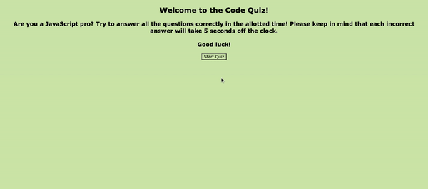

# 04 Web APIs: Code Quiz

## User Story

```
AS A coding boot camp student
I WANT to take a timed quiz on JavaScript fundamentals that stores high scores
SO THAT I can gauge my progress compared to my peers
```

## Acceptance Criteria

```
GIVEN I am taking a code quiz
WHEN I click the start button
THEN a timer starts and I am presented with a question
WHEN I answer a question
THEN I am presented with another question
WHEN I answer a question incorrectly
THEN time is subtracted from the clock
WHEN all questions are answered or the timer reaches 0
THEN the game is over
WHEN the game is over
THEN I can save my initials and my score
```

## Description
This application is a simple quiz on JavaScript fundamentals. Users are given 30 seconds to answer 5 multiple-choic questions. A timer is displayed above the current question, and for each incorrect answer the time decrements by 5 seconds. The user is shown which answers are correct or incorrect as they answer. Upon completion of the quiz, users are presented with their final score. Users can then enter their initials to save their score, and presented with a button to restart the quiz . After completion of the first attempt, the list of high scores will remain on the page below the quiz. 

### Preview of Deployed Application
The following animation demonstrates the application's functionality:



### Link to Deployed Application

* https://kirstynrowen.github.io/code-quiz/

---


